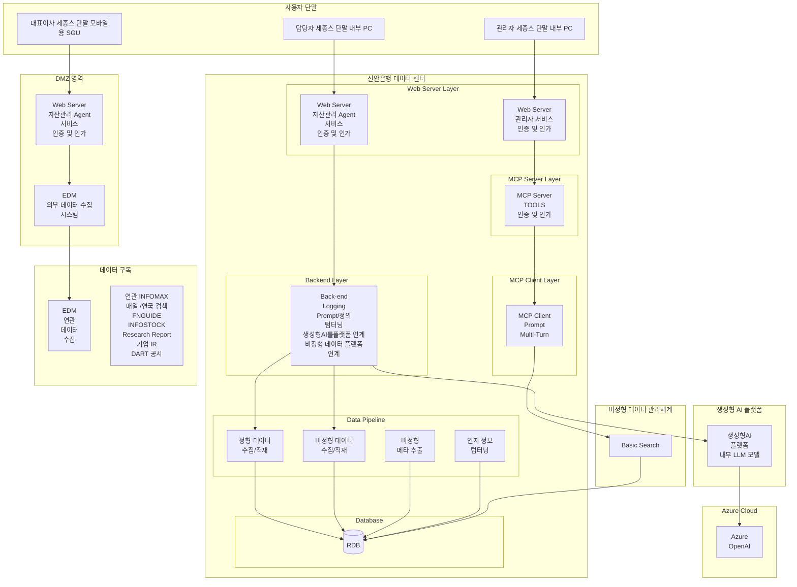
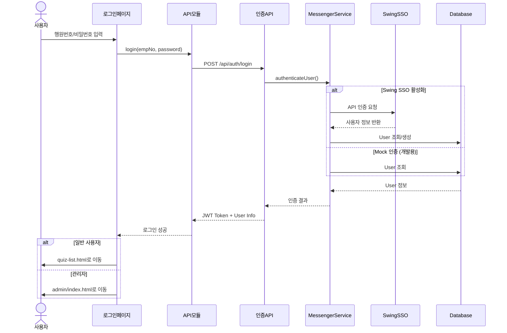
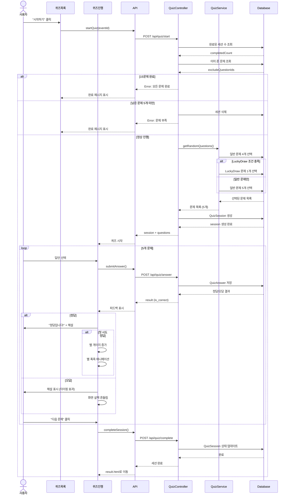

# ICT 내규 퀴즈 시스템 아키텍처

## 시스템 구성도

## ICT 내규 퀴즈 시스템 상세 아키텍처

```mermaid
graph TB
    subgraph "사용자 인터페이스"
        USER[사용자 PC/모바일]
        ADMIN[관리자 PC]
    end

    subgraph "Frontend - Client Layer"
        LOGIN[로그인 페이지<br/>index.html]
        QUIZ_LIST[퀴즈 목록 페이지<br/>quiz-list.html]
        QUIZ[퀴즈 진행 페이지<br/>quiz.html]
        RESULT[결과 페이지<br/>result.html]
        ADMIN_PAGE[관리자 페이지<br/>admin/*.html]
        
        subgraph "JavaScript Modules"
            API[API Client<br/>api.js]
            AUTH[인증 모듈<br/>auth.js]
            UTILS[유틸리티<br/>utils.js]
        end
        
        subgraph "CSS Styles"
            GLOBAL_CSS[Global Styles<br/>nes.css, global.css]
            PAGE_CSS[Page Styles<br/>login.css, quiz.css<br/>quiz-list.css, result.css]
            ANIM_CSS[Animations<br/>animations.css]
        end
    end

    subgraph "Backend - Server Layer (Node.js + Express)"
        subgraph "API Routes"
            AUTH_ROUTE[인증 API<br/>/api/auth/*]
            QUIZ_ROUTE[퀴즈 API<br/>/api/quiz/*]
            ADMIN_ROUTE[관리자 API<br/>/api/admin/*]
        end
        
        subgraph "Controllers"
            AUTH_CTRL[authController.js<br/>로그인/로그아웃 처리]
            QUIZ_CTRL[quizController.js<br/>퀴즈 세션/답안 처리]
            ADMIN_CTRL[adminController.js<br/>이벤트/문제 관리]
        end
        
        subgraph "Services"
            MESSENGER_SVC[messengerService.js<br/>사내 메신저 연동<br/>Mock/Stub 구현]
            QUIZ_SVC[quizService.js<br/>문제 선택 로직<br/>LuckyDraw 로직]
            SWING_API[swingApiClient.js<br/>Swing API 클라이언트]
            SWING_AUTH[swingAuthService.js<br/>Swing SSO 인증]
        end
        
        subgraph "Models (Sequelize ORM)"
            USER_MODEL[User.js<br/>사용자 정보]
            EVENT_MODEL[QuizEvent.js<br/>퀴즈 이벤트]
            QUESTION_MODEL[Question.js<br/>문제 정보]
            SESSION_MODEL[QuizSession.js<br/>세션 정보]
            ANSWER_MODEL[QuizAnswer.js<br/>답안 정보]
            LUCKY_MODEL[LuckyDraw.js<br/>럭키드로우 정보]
            SSO_MODEL[SSOSettings.js<br/>SSO 설정]
        end
        
        subgraph "Middleware"
            AUTH_MW[auth.js<br/>JWT 토큰 검증<br/>권한 확인]
        end
        
        subgraph "Utils"
            JWT_UTIL[jwt.js<br/>토큰 생성/검증]
        end
    end

    subgraph "Database Layer"
        SQLITE[(SQLite Database<br/>quiz.db)]
        
        subgraph "Tables"
            USERS_TABLE[Users<br/>사용자]
            EVENTS_TABLE[QuizEvents<br/>이벤트]
            QUESTIONS_TABLE[Questions<br/>문제]
            SESSIONS_TABLE[QuizSessions<br/>세션]
            ANSWERS_TABLE[QuizAnswers<br/>답안]
            LUCKY_TABLE[LuckyDraws<br/>럭키드로우]
            SSO_TABLE[SSOSettings<br/>SSO설정]
        end
    end

    subgraph "External Services"
        SWING_SSO[Swing SSO<br/>사내 메신저 인증<br/>사용자 정보 조회]
    end

    %% User Connections
    USER --> LOGIN
    USER --> QUIZ_LIST
    USER --> QUIZ
    USER --> RESULT
    ADMIN --> ADMIN_PAGE

    %% Frontend Internal Connections
    LOGIN --> API
    QUIZ_LIST --> API
    QUIZ --> API
    RESULT --> API
    ADMIN_PAGE --> API
    
    API --> AUTH
    API --> UTILS
    
    LOGIN -.uses.-> GLOBAL_CSS
    LOGIN -.uses.-> PAGE_CSS
    LOGIN -.uses.-> ANIM_CSS
    
    QUIZ_LIST -.uses.-> GLOBAL_CSS
    QUIZ_LIST -.uses.-> PAGE_CSS
    QUIZ_LIST -.uses.-> ANIM_CSS
    
    QUIZ -.uses.-> GLOBAL_CSS
    QUIZ -.uses.-> PAGE_CSS
    QUIZ -.uses.-> ANIM_CSS
    
    RESULT -.uses.-> GLOBAL_CSS
    RESULT -.uses.-> PAGE_CSS
    RESULT -.uses.-> ANIM_CSS

    %% API to Routes
    API -->|HTTP Request| AUTH_ROUTE
    API -->|HTTP Request| QUIZ_ROUTE
    API -->|HTTP Request| ADMIN_ROUTE

    %% Routes to Controllers
    AUTH_ROUTE --> AUTH_CTRL
    QUIZ_ROUTE --> QUIZ_CTRL
    ADMIN_ROUTE --> ADMIN_CTRL

    %% Controllers to Services
    AUTH_CTRL --> MESSENGER_SVC
    AUTH_CTRL --> SWING_AUTH
    QUIZ_CTRL --> QUIZ_SVC
    ADMIN_CTRL --> QUIZ_SVC

    %% Services to Models
    MESSENGER_SVC --> USER_MODEL
    SWING_AUTH --> USER_MODEL
    SWING_AUTH --> SSO_MODEL
    QUIZ_SVC --> QUESTION_MODEL
    QUIZ_SVC --> SESSION_MODEL
    QUIZ_SVC --> ANSWER_MODEL
    QUIZ_SVC --> LUCKY_MODEL
    QUIZ_SVC --> EVENT_MODEL
    
    AUTH_CTRL --> USER_MODEL
    QUIZ_CTRL --> SESSION_MODEL
    QUIZ_CTRL --> ANSWER_MODEL
    ADMIN_CTRL --> EVENT_MODEL
    ADMIN_CTRL --> QUESTION_MODEL
    ADMIN_CTRL --> LUCKY_MODEL

    %% Middleware
    AUTH_ROUTE -.validate.-> AUTH_MW
    QUIZ_ROUTE -.validate.-> AUTH_MW
    ADMIN_ROUTE -.validate.-> AUTH_MW
    
    AUTH_MW --> JWT_UTIL

    %% Models to Database
    USER_MODEL --> SQLITE
    EVENT_MODEL --> SQLITE
    QUESTION_MODEL --> SQLITE
    SESSION_MODEL --> SQLITE
    ANSWER_MODEL --> SQLITE
    LUCKY_MODEL --> SQLITE
    SSO_MODEL --> SQLITE
    
    SQLITE --> USERS_TABLE
    SQLITE --> EVENTS_TABLE
    SQLITE --> QUESTIONS_TABLE
    SQLITE --> SESSIONS_TABLE
    SQLITE --> ANSWERS_TABLE
    SQLITE --> LUCKY_TABLE
    SQLITE --> SSO_TABLE

    %% External Services
    SWING_AUTH -->|API Call| SWING_SSO
    SWING_API -->|API Call| SWING_SSO

    style USER fill:#ff9999
    style ADMIN fill:#ff6666
    style SQLITE fill:#9999ff
    style SWING_SSO fill:#99ff99
```

## 데이터 흐름도 (Data Flow)

## 퀴즈 진행 흐름도

## 시스템 구성 요소

### 1. Frontend (Client)

#### 1.1 페이지 구성
- **index.html**: 로그인 페이지
  - 행원번호/비밀번호 입력
  - NES.css 픽셀 스타일
  - 로그인 애니메이션
  
- **quiz-list.html**: 퀴즈 목록 페이지
  - 월별 퀴즈 이벤트 목록
  - 진행 상황 표시 (X/15)
  - 회차 정보 (1회차/2회차/3회차)
  - 별 아이콘 (LuckyDraw 상태)
  - 나무판자 디자인
  
- **quiz.html**: 퀴즈 진행 페이지
  - 5가지 문제 유형 인터랙티브 UI
  - 실시간 피드백 (정답/오답)
  - 타이핑 효과 해설
  - 별 게이지 애니메이션
  - 폭죽 애니메이션
  
- **result.html**: 결과 페이지
  - 별 획득 정보
  - "그만하기" / "계속하기" 선택

- **admin/*.html**: 관리자 페이지
  - 이벤트 관리
  - 문제 관리
  - 통계 대시보드
  - LuckyDraw 관리

#### 1.2 JavaScript 모듈
- **api.js**: HTTP 클라이언트
  - Fetch API 래퍼
  - 에러 핸들링
  - JWT 토큰 관리
  
- **auth.js**: 인증 모듈
  - 로그인 상태 확인
  - 토큰 저장/삭제
  - 권한 확인
  
- **utils.js**: 유틸리티
  - DOM 헬퍼
  - 애니메이션 헬퍼
  - 사운드 재생

#### 1.3 CSS 스타일
- **nes.css**: 8비트 픽셀 UI 프레임워크
- **global.css**: 전역 스타일
- **animations.css**: 애니메이션 정의
- **login.css, quiz.css, quiz-list.css, result.css**: 페이지별 스타일

### 2. Backend (Server)

#### 2.1 API Routes
- **auth.js** (`/api/auth/*`)
  - POST `/login`: 로그인
  - POST `/logout`: 로그아웃
  - GET `/me`: 현재 사용자 정보
  
- **quiz.js** (`/api/quiz/*`)
  - GET `/list`: 퀴즈 목록
  - POST `/start`: 퀴즈 시작
  - POST `/answer`: 답안 제출
  - POST `/complete`: 세션 완료
  - GET `/session/:sessionId`: 세션 정보
  
- **admin.js** (`/api/admin/*`)
  - Events: CRUD
  - Questions: CRUD
  - Statistics: GET
  - LuckyDraw: GET/POST

#### 2.2 Controllers
- **authController.js**: 인증 로직
  - 로그인/로그아웃 처리
  - JWT 토큰 발급
  - 사용자 정보 조회
  
- **quizController.js**: 퀴즈 로직
  - 세션 생성/완료
  - 답안 제출/검증
  - 진행 상황 추적
  
- **adminController.js**: 관리 로직
  - 이벤트 관리
  - 문제 관리
  - 통계 생성

#### 2.3 Services
- **messengerService.js**: 사내 메신저 연동
  - 사용자 인증 (Mock/Stub)
  - 사용자 정보 조회
  - 추후 실제 API 연동
  
- **quizService.js**: 퀴즈 비즈니스 로직
  - 랜덤 문제 선택
  - LuckyDraw 조건 확인
  - 중복 방지 로직
  - 퀴즈 목록 생성
  
- **swingApiClient.js**: Swing API 클라이언트
  - HTTP 요청 처리
  - 토큰 관리
  
- **swingAuthService.js**: Swing SSO 인증
  - SSO 로그인
  - 사용자 정보 동기화

#### 2.4 Models (Sequelize ORM)
- **User.js**: 사용자 정보
  - emp_no, name, email, department, position
  - role (user/admin)
  - swing_user_id, swing_access_token
  
- **QuizEvent.js**: 퀴즈 이벤트
  - event_name, start_date, end_date
  - is_active, total_questions
  
- **Question.js**: 문제 정보
  - question_type, question_text
  - correct_answer, options
  - category (normal/luckydraw)
  - explanation
  
- **QuizSession.js**: 세션 정보
  - user_id, event_id
  - status (ongoing/completed)
  - started_at, completed_at
  
- **QuizAnswer.js**: 답안 정보
  - session_id, question_id
  - user_answer, is_correct
  - answer_attempt, answered_at
  
- **LuckyDraw.js**: 럭키드로우 정보
  - user_id, event_id
  - is_winner, prize_name
  
- **SSOSettings.js**: SSO 설정
  - api_base_url, api_key
  - is_enabled

#### 2.5 Middleware
- **auth.js**: 인증 미들웨어
  - JWT 토큰 검증
  - 사용자 권한 확인
  - 관리자 권한 확인

#### 2.6 Utils
- **jwt.js**: JWT 유틸리티
  - 토큰 생성
  - 토큰 검증
  - 토큰 디코딩

### 3. Database (SQLite)

#### 3.1 테이블
- **Users**: 사용자 정보
- **QuizEvents**: 퀴즈 이벤트
- **Questions**: 문제 정보
- **QuizSessions**: 세션 정보
- **QuizAnswers**: 답안 정보
- **LuckyDraws**: 럭키드로우 정보
- **SSOSettings**: SSO 설정

#### 3.2 관계 (Relationships)
- User 1:N QuizSession
- QuizEvent 1:N Question
- QuizEvent 1:N QuizSession
- QuizSession 1:N QuizAnswer
- Question 1:N QuizAnswer
- User 1:N LuckyDraw
- QuizEvent 1:N LuckyDraw

### 4. External Services

#### 4.1 Swing SSO (사내 메신저)
- **기능**: 사용자 인증 및 정보 조회
- **상태**: 추후 연동 예정 (현재 Mock)
- **API**:
  - 로그인 인증
  - 사용자 정보 조회
  - 토큰 갱신

## 기술 스택

### Frontend
- HTML5, CSS3, JavaScript (ES6+)
- Vanilla JavaScript (프레임워크 없음)
- NES.css (픽셀 UI)
- Fetch API

### Backend
- Node.js 18+
- Express.js (MVC 패턴)
- Sequelize ORM
- SQLite 3
- JWT (인증)
- bcrypt (비밀번호 해싱)

### DevOps
- Git (버전 관리)
- npm (패키지 관리)
- Sequelize CLI (마이그레이션)

## 보안 고려사항

### 1. 인증/인가
- JWT 토큰 기반 인증
- HttpOnly 쿠키 (선택적)
- 권한 기반 접근 제어 (RBAC)

### 2. 데이터 보안
- 비밀번호 bcrypt 해싱
- SQL Injection 방지 (ORM 사용)
- XSS 방지 (입력 검증)

### 3. API 보안
- CORS 설정
- Rate Limiting (추후 적용)
- API 키 관리

## 성능 최적화

### 1. Frontend
- CSS/JS 파일 분리
- 이미지 최적화
- 애니메이션 최적화 (requestAnimationFrame)
- 로컬 스토리지 활용

### 2. Backend
- 데이터베이스 인덱싱
- 쿼리 최적화 (N+1 문제 해결)
- 캐싱 (추후 적용)
- Connection Pooling

### 3. Database
- SQLite 인덱스 활용
- 트랜잭션 관리
- 쿼리 성능 모니터링

## 확장 가능성

### 1. 단기 확장
- Swing SSO 실제 연동
- 관리자 통계 대시보드 고도화
- 문제 유형 추가

### 2. 중기 확장
- Redis 캐싱 도입
- PostgreSQL 마이그레이션
- 실시간 알림 (WebSocket)
- 모바일 앱 지원

### 3. 장기 확장
- 마이크로서비스 전환
- 클라우드 배포 (AWS/Azure)
- AI 기반 문제 추천
- 게임화 요소 강화

## 배포 환경

### 개발 환경
- Frontend: http://localhost:3000
- Backend: http://localhost:5000
- Database: SQLite (파일 기반)

### 운영 환경 (추후)
- 사내 네트워크
- Linux 서버
- Nginx (리버스 프록시)
- PM2 (프로세스 관리)
- PostgreSQL (DB)

## 모니터링 및 로깅

### 로깅
- Winston (서버 로그)
- Morgan (HTTP 로그)
- 에러 로그 파일 저장

### 모니터링 (추후)
- 서버 상태 모니터링
- API 응답 시간 추적
- 에러 추적 (Sentry)
- 사용자 행동 분석

## 문서

- **SPECIFICATION.md**: 프로젝트 명세서
- **README.md**: 빠른 시작 가이드
- **ARCHITECTURE.md**: 이 파일 (아키텍처 문서)
- **LUCKY_DRAW_IMPLEMENTATION.md**: LuckyDraw 구현 가이드
- **DYNAMIC_LUCKY_DRAW_IMPLEMENTATION.md**: 동적 LuckyDraw 구현
- **SWING_SSO_IMPLEMENTATION.md**: Swing SSO 연동 가이드

## 유지보수

### 정기 작업
- 데이터베이스 백업 (주간)
- 로그 파일 정리 (월간)
- 의존성 업데이트 (월간)
- 보안 패치 (수시)

### 모니터링 항목
- 서버 가동 시간
- API 응답 속도
- 에러 발생률
- 사용자 활동 추이

---

**작성일**: 2025-01-06  
**버전**: 1.0.0  
**작성자**: ICT 내규 퀴즈 개발팀

