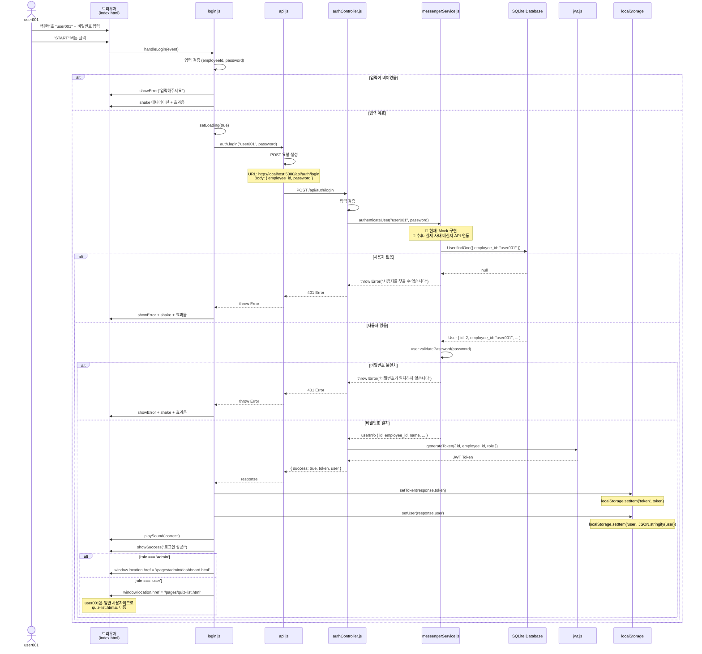
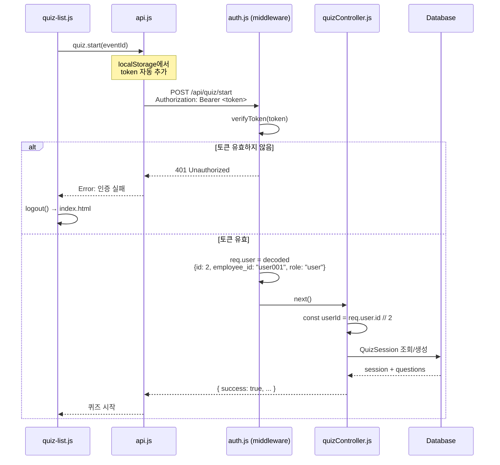

# 현재 인증 흐름도 (user001 로그인 시)

## 전체 인증 흐름 다이어그램



## 상세 단계별 설명

### 1. 프론트엔드 - 로그인 폼 제출

**파일**: `client/js/pages/login.js`

```javascript
// 1-1. 사용자 입력
const employeeId = "user001";
const password = "user001";

// 1-2. 입력 검증
if (!employeeId || !password) {
  showError('행원번호와 비밀번호를 입력해주세요');
  return;
}

// 1-3. API 호출
const response = await auth.login(employeeId, password);
```

**순서**:
1. 사용자가 `index.html`에서 행원번호 "user001", 비밀번호 입력
2. "START" 버튼 클릭
3. `loginForm.addEventListener('submit', handleLogin)` 이벤트 발생
4. `handleLogin()` 함수 실행
5. 입력 검증 후 `auth.login()` 호출

---

### 2. API 클라이언트 - HTTP 요청

**파일**: `client/js/modules/api.js`

```javascript
// 2-1. POST 요청 생성
export const auth = {
  async login(employeeId, password) {
    return post('/auth/login', {
      employee_id: employeeId,
      password
    });
  }
};

// 2-2. Fetch 실행
const url = 'http://localhost:5000/api/auth/login';
const response = await fetch(url, {
  method: 'POST',
  headers: {
    'Content-Type': 'application/json'
  },
  body: JSON.stringify({
    employee_id: 'user001',
    password: 'user001'
  })
});
```

**순서**:
1. `auth.login()` → `post('/auth/login', data)` 호출
2. `request()` 함수에서 Fetch API 실행
3. `http://localhost:5000/api/auth/login`로 POST 요청
4. 서버 응답 대기

---

### 3. 백엔드 - 인증 컨트롤러

**파일**: `server/controllers/authController.js`

```javascript
const login = async (req, res) => {
  // 3-1. 요청 파라미터 추출
  const { employee_id, password } = req.body;
  // employee_id = "user001"
  // password = "user001"

  // 3-2. 입력 검증
  if (!employee_id || !password) {
    return res.status(400).json({
      error: '행원번호와 비밀번호를 입력해주세요'
    });
  }

  // 3-3. 사내 메신저 서비스 인증 호출
  const userInfo = await messengerService.authenticateUser(
    employee_id,  // "user001"
    password      // "user001"
  );

  // 3-4. JWT 토큰 생성
  const token = generateToken({
    id: userInfo.id,          // 2
    employee_id: userInfo.employee_id,  // "user001"
    role: userInfo.role       // "user"
  });

  // 3-5. 응답 반환
  res.json({
    success: true,
    token,
    user: {
      id: userInfo.id,
      employee_id: userInfo.employee_id,
      name: userInfo.name,
      department: userInfo.department,
      email: userInfo.email,
      role: userInfo.role
    }
  });
};
```

**순서**:
1. Express 라우터 `/api/auth/login`로 요청 도착
2. `authController.login()` 함수 실행
3. 요청 바디에서 `employee_id`, `password` 추출
4. 입력 검증
5. `messengerService.authenticateUser()` 호출

---

### 4. 메신저 서비스 - 사용자 인증 (현재: Mock)

**파일**: `server/services/messengerService.js`

```javascript
async authenticateUser(employeeId, password) {
  // 4-1. TODO: 실제 사내 메신저 API 연동 (추후)
  // const response = await fetch(`${MESSENGER_API_URL}/auth`, {
  //   method: 'POST',
  //   headers: { 'Authorization': `Bearer ${MESSENGER_API_KEY}` },
  //   body: JSON.stringify({ employeeId, password })
  // });

  // 4-2. 현재: Mock 구현 - DB에서 사용자 조회
  const user = await db.User.findOne({
    where: { employee_id: employeeId }  // "user001"
  });

  // 4-3. 사용자 존재 확인
  if (!user) {
    throw new Error('사용자를 찾을 수 없습니다');
  }

  // 4-4. 비밀번호 검증 (bcrypt)
  const isValid = await user.validatePassword(password);
  if (!isValid) {
    throw new Error('비밀번호가 일치하지 않습니다');
  }

  // 4-5. 사용자 정보 반환
  return {
    id: user.id,                    // 2
    employee_id: user.employee_id,  // "user001"
    name: user.name,                // "테스트사용자1"
    department: user.department,    // "테크부서"
    email: user.email,              // "user001@company.com"
    role: user.role                 // "user"
  };
}
```

**순서**:
1. `authenticateUser("user001", "user001")` 실행
2. **현재**: SQLite DB에서 `Users` 테이블 조회
   - `SELECT * FROM Users WHERE employee_id = 'user001'`
3. **추후**: 실제 사내 메신저 API로 HTTP 요청
   - `POST https://messenger-api.company.com/auth`
4. 사용자 존재 여부 확인
5. 비밀번호 검증 (`bcrypt.compare()`)
6. 사용자 정보 객체 반환

---

### 5. 데이터베이스 - 사용자 조회

**파일**: `database/quiz.db` (SQLite)

**쿼리 실행**:
```sql
SELECT 
  id, 
  employee_id, 
  name, 
  department, 
  email, 
  role, 
  password
FROM Users
WHERE employee_id = 'user001'
LIMIT 1;
```

**결과** (user001):
```json
{
  "id": 2,
  "employee_id": "user001",
  "name": "테스트사용자1",
  "department": "테크부서",
  "email": "user001@company.com",
  "role": "user",
  "password": "$2b$10$..." // bcrypt 해시
}
```

---

### 6. 비밀번호 검증 - bcrypt

**파일**: `server/models/User.js`

```javascript
// User 모델 인스턴스 메서드
User.prototype.validatePassword = async function(password) {
  return await bcrypt.compare(
    password,        // 입력한 비밀번호 "user001"
    this.password    // DB에 저장된 해시 "$2b$10$..."
  );
};
```

**순서**:
1. `bcrypt.compare("user001", "$2b$10$...")`
2. bcrypt가 입력 비밀번호를 해싱하여 DB 해시와 비교
3. 일치하면 `true`, 불일치하면 `false` 반환

---

### 7. JWT 토큰 생성

**파일**: `server/utils/jwt.js`

```javascript
const jwt = require('jsonwebtoken');

function generateToken(payload) {
  return jwt.sign(
    payload,  // { id: 2, employee_id: "user001", role: "user" }
    process.env.JWT_SECRET || 'your_super_secret_jwt_key',
    { expiresIn: process.env.JWT_EXPIRES_IN || '7d' }
  );
}
```

**생성된 토큰 예시**:
```
eyJhbGciOiJIUzI1NiIsInR5cCI6IkpXVCJ9.eyJpZCI6MiwiZW1wbG95ZWVfaWQiOiJ1c2VyMDAxIiwicm9sZSI6InVzZXIiLCJpYXQiOjE3MDQwMDAwMDAsImV4cCI6MTcwNDYwNDgwMH0.xxxxx
```

**토큰 구조**:
- **Header**: `{"alg":"HS256","typ":"JWT"}`
- **Payload**: `{"id":2,"employee_id":"user001","role":"user","iat":1704000000,"exp":1704604800}`
- **Signature**: HMAC-SHA256 서명

---

### 8. 응답 반환 - 서버 → 클라이언트

**JSON 응답**:
```json
{
  "success": true,
  "token": "eyJhbGciOiJIUzI1NiIsInR5cCI6IkpXVCJ9...",
  "user": {
    "id": 2,
    "employee_id": "user001",
    "name": "테스트사용자1",
    "department": "테크부서",
    "email": "user001@company.com",
    "role": "user"
  }
}
```

**HTTP Status**: `200 OK`

---

### 9. 프론트엔드 - 토큰 저장 및 리다이렉트

**파일**: `client/js/pages/login.js`, `client/js/modules/auth.js`

```javascript
// 9-1. 응답 수신
if (response.success) {
  // 9-2. 토큰 저장
  setToken(response.token);
  // localStorage.setItem('token', 'eyJhbGciOi...')

  // 9-3. 사용자 정보 저장
  setUser(response.user);
  // localStorage.setItem('user', '{"id":2,"employee_id":"user001",...}')

  // 9-4. 효과음
  playSound('correct');

  // 9-5. 성공 메시지
  showSuccess('로그인 성공!');

  // 9-6. 페이지 이동
  setTimeout(() => {
    if (response.user.role === 'admin') {
      window.location.href = '/pages/admin/dashboard.html';
    } else {
      // user001은 일반 사용자이므로 quiz-list.html로 이동
      window.location.href = '/pages/quiz-list.html';
    }
  }, 500);
}
```

**localStorage에 저장된 데이터**:
```javascript
// localStorage.getItem('token')
"eyJhbGciOiJIUzI1NiIsInR5cCI6IkpXVCJ9..."

// localStorage.getItem('user')
"{\"id\":2,\"employee_id\":\"user001\",\"name\":\"테스트사용자1\",\"department\":\"테크부서\",\"email\":\"user001@company.com\",\"role\":\"user\"}"
```

---

### 10. 페이지 이동 후 인증 확인

**파일**: `client/js/pages/quiz-list.js`

```javascript
import { requireAuth, getUser } from '../modules/auth.js';

// 10-1. 인증 확인
requireAuth();
// → localStorage에 token이 있는지 확인
// → 없으면 index.html로 리다이렉트

// 10-2. 사용자 정보 표시
const user = getUser();
// → localStorage에서 user 정보 읽기
// → JSON.parse()하여 객체로 변환

if (user) {
  userNameDisplay.textContent = `${user.name}님`;
  // "테스트사용자1님"
}
```

---

## 이후 API 요청 시 인증 흐름

### 퀴즈 시작 API 호출 시



**파일**: `client/js/modules/api.js`

```javascript
async function request(endpoint, options = {}) {
  // 토큰이 있으면 헤더에 자동 추가
  const token = localStorage.getItem('token');
  if (token) {
    config.headers['Authorization'] = `Bearer ${token}`;
  }
  
  const response = await fetch(url, config);
  // ...
}
```

**파일**: `server/middleware/auth.js`

```javascript
const authenticate = async (req, res, next) => {
  // 1. Authorization 헤더에서 토큰 추출
  const authHeader = req.headers.authorization;
  const token = authHeader && authHeader.split(' ')[1];

  // 2. 토큰 검증
  const decoded = verifyToken(token);
  // decoded = { id: 2, employee_id: "user001", role: "user", ... }

  // 3. req.user에 사용자 정보 저장
  req.user = decoded;
  
  next();
};
```

---

## 현재 인증 방식 정리

### 인증 방법
- **현재**: Mock 인증 (SQLite DB 직접 조회)
- **추후**: 사내 메신저 API 연동 (Swing SSO)

### 인증 흐름
1. **로그인 요청** → POST `/api/auth/login`
2. **Mock 인증** → SQLite `Users` 테이블 조회
3. **비밀번호 검증** → bcrypt.compare()
4. **JWT 발급** → 7일 유효기간
5. **토큰 저장** → localStorage
6. **이후 요청** → Authorization 헤더에 토큰 자동 첨부
7. **토큰 검증** → JWT 미들웨어
8. **사용자 식별** → req.user에 정보 저장

### user001의 인증 정보

```json
{
  "id": 2,
  "employee_id": "user001",
  "name": "테스트사용자1",
  "department": "테크부서",
  "email": "user001@company.com",
  "role": "user",
  "password": "$2b$10$..." // bcrypt 해시
}
```

### JWT 토큰 내용

```json
{
  "id": 2,
  "employee_id": "user001",
  "role": "user",
  "iat": 1704000000,
  "exp": 1704604800
}
```

---

## 보안 고려사항

### 현재 구현
1. ✅ 비밀번호 bcrypt 해싱
2. ✅ JWT 토큰 기반 인증
3. ✅ 7일 토큰 만료
4. ✅ Authorization 헤더 전송
5. ✅ 미들웨어 토큰 검증

### 추가 필요사항 (추후)
1. ⏳ Refresh Token 구현
2. ⏳ HTTPS 전송
3. ⏳ CORS 정책 강화
4. ⏳ Rate Limiting
5. ⏳ 사내 메신저 SSO 연동

---

## 에러 처리 흐름

### 1. 사용자 없음

```
User Input → API → authController → messengerService
→ DB Query (null)
→ throw Error("사용자를 찾을 수 없습니다")
→ 401 Response
→ showError + shake + 효과음
```

### 2. 비밀번호 불일치

```
User Input → API → authController → messengerService
→ DB Query (user found)
→ bcrypt.compare() = false
→ throw Error("비밀번호가 일치하지 않습니다")
→ 401 Response
→ showError + shake + 효과음
```

### 3. 토큰 만료/유효하지 않음

```
API Request → middleware
→ verifyToken() fails
→ 401 Response
→ logout() → index.html 리다이렉트
```

---

**작성일**: 2025-01-06  
**버전**: 1.0.0  
**대상**: user001 (일반 사용자)  
**인증 방식**: Mock (DB 직접 조회) → 추후 사내 메신저 API 연동 예정

