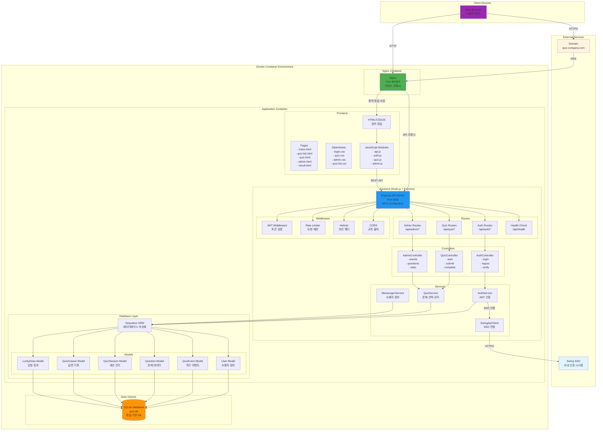
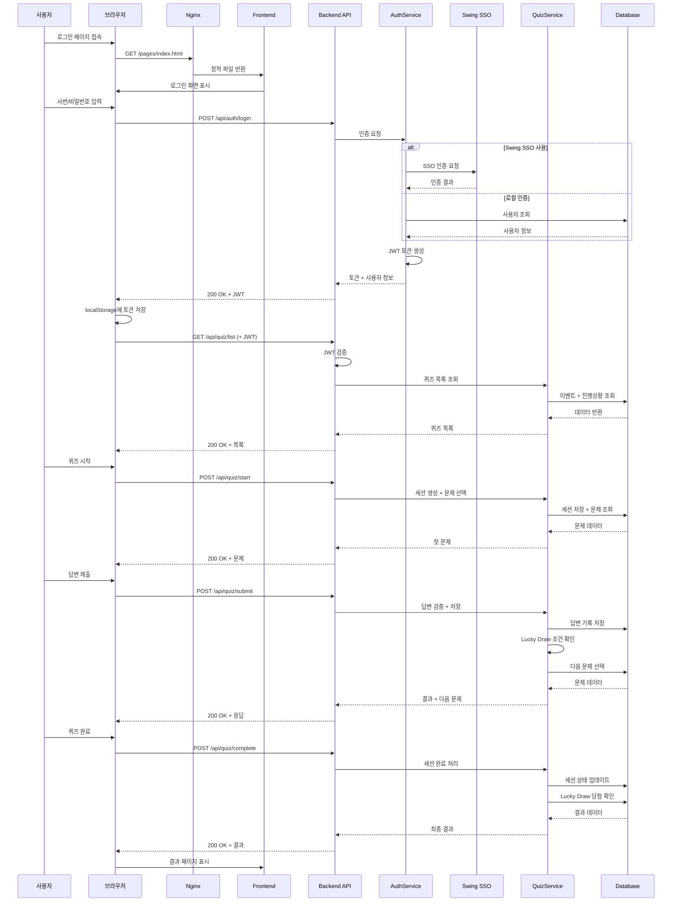
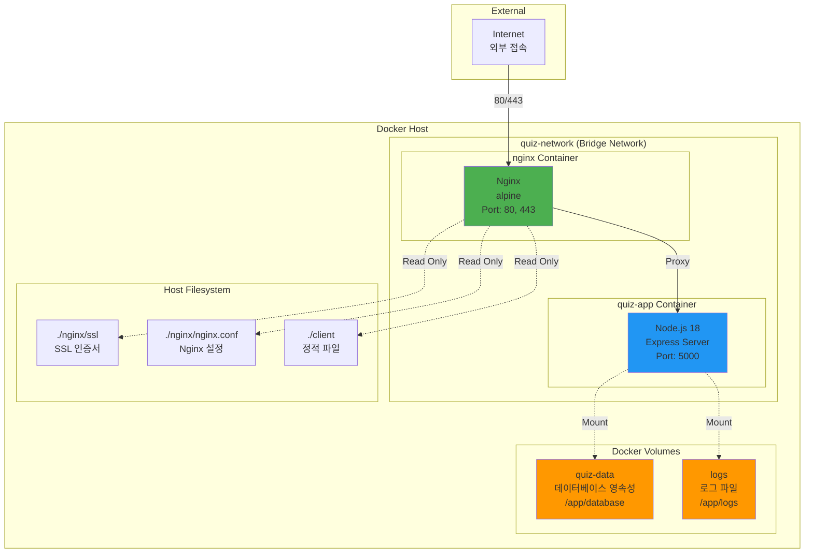
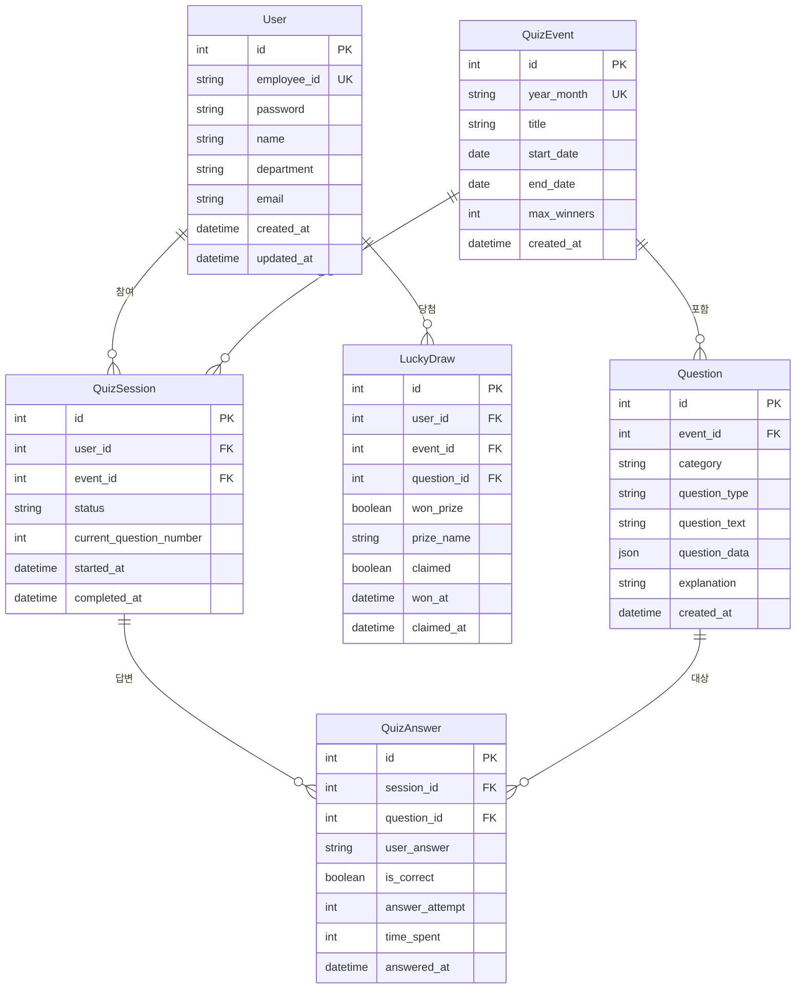
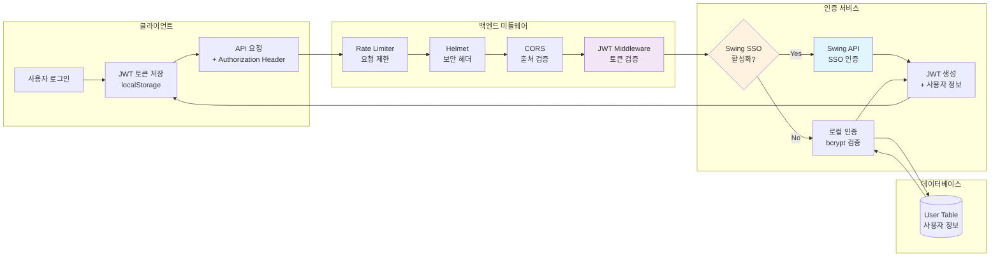
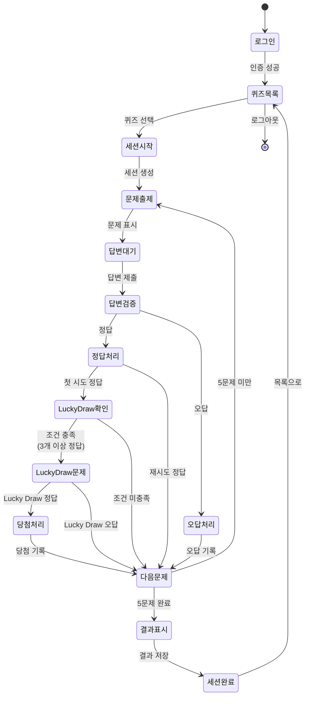
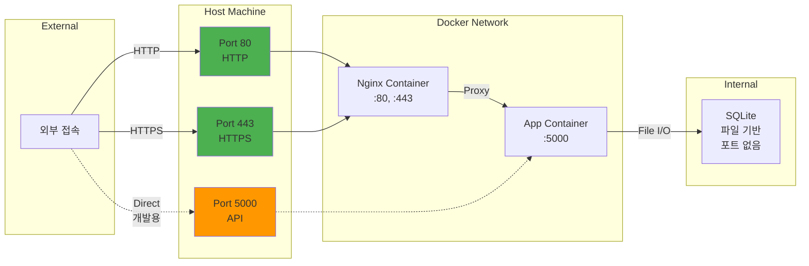
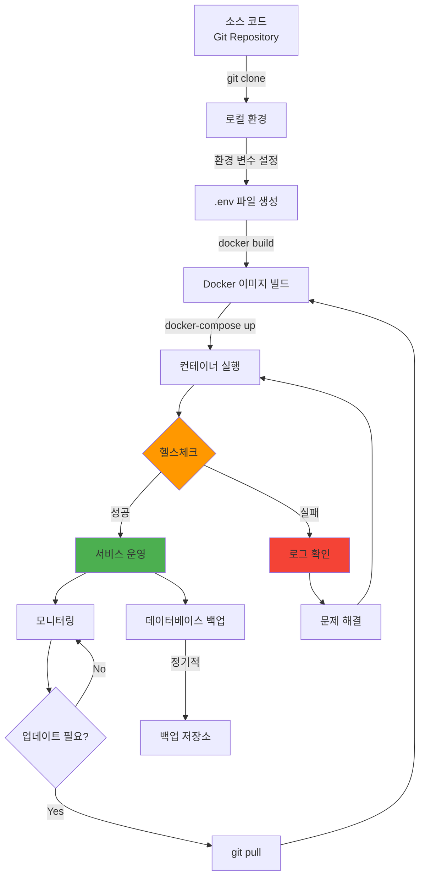
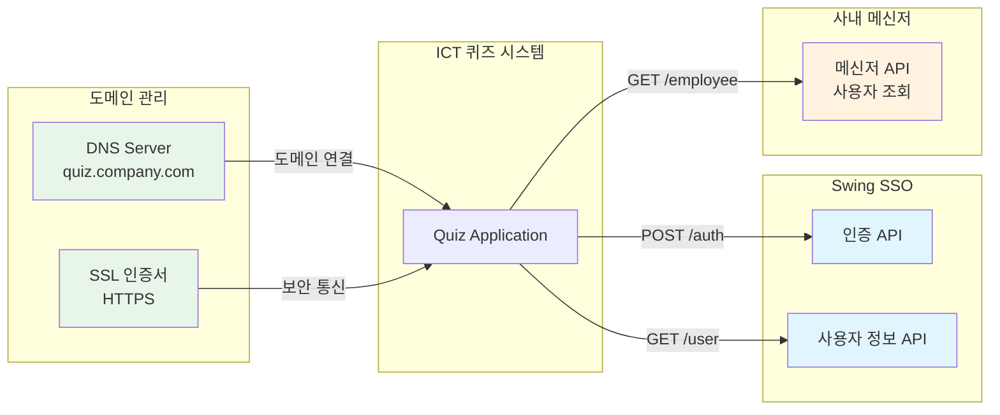

# ICT 내규 퀴즈 시스템 구성도

## 📊 전체 시스템 아키텍처



---

## 🔄 데이터 흐름도 (Data Flow)



---

## 🏗️ Docker 컨테이너 구성도



---

## 🗄️ 데이터베이스 스키마



---

## 🔐 인증 및 보안 흐름



---

## 🎮 퀴즈 게임 로직 흐름



---

## 🌐 네트워크 포트 구성



---

## 📁 프로젝트 디렉토리 구조

```
IctRulesQuiz/
├── 📦 Docker 관련
│   ├── Dockerfile                 # 이미지 정의
│   ├── docker-compose.yml         # 컨테이너 오케스트레이션
│   ├── .dockerignore             # 빌드 제외 파일
│   └── nginx/
│       ├── nginx.conf            # Nginx 설정
│       └── ssl/                  # SSL 인증서
│
├── 🎨 Frontend (client/)
│   ├── pages/                    # HTML 페이지
│   │   ├── index.html           # 로그인
│   │   ├── quiz-list.html       # 퀴즈 목록
│   │   ├── quiz.html            # 퀴즈 게임
│   │   ├── result.html          # 결과
│   │   └── admin.html           # 관리자
│   ├── css/                      # 스타일시트
│   │   ├── login.css
│   │   ├── quiz.css
│   │   ├── quiz-list.css
│   │   ├── admin.css
│   │   └── variables.css
│   ├── js/
│   │   ├── modules/             # 공통 모듈
│   │   │   ├── api.js          # API 클라이언트
│   │   │   ├── auth.js         # 인증 관리
│   │   │   └── utils.js        # 유틸리티
│   │   └── pages/               # 페이지별 로직
│   │       ├── quiz.js
│   │       ├── quiz-list.js
│   │       └── admin-dashboard.js
│   └── assets/                   # 이미지, 폰트 등
│
├── ⚙️ Backend (server/)
│   ├── server.js                # 서버 진입점
│   ├── app.js                   # Express 앱 설정
│   ├── config/
│   │   └── database.js         # DB 설정
│   ├── models/                  # Sequelize 모델
│   │   ├── User.js
│   │   ├── QuizEvent.js
│   │   ├── Question.js
│   │   ├── QuizSession.js
│   │   ├── QuizAnswer.js
│   │   └── LuckyDraw.js
│   ├── controllers/             # 컨트롤러
│   │   ├── authController.js
│   │   ├── quizController.js
│   │   └── adminController.js
│   ├── services/                # 비즈니스 로직
│   │   ├── authService.js
│   │   ├── quizService.js
│   │   ├── swingApiClient.js
│   │   └── messengerService.js
│   ├── middleware/              # 미들웨어
│   │   └── auth.js
│   └── routes/                  # 라우트 정의
│       ├── auth.js
│       ├── quiz.js
│       ├── admin.js
│       └── health.js
│
├── 🗄️ Database (database/)
│   └── quiz.db                  # SQLite 데이터베이스
│
├── 📜 Scripts (scripts/)
│   ├── deploy.sh               # Linux/Mac 배포
│   └── deploy.bat              # Windows 배포
│
└── 📚 Documentation (docs/)
    ├── SYSTEM_ARCHITECTURE.md  # 시스템 구성도
    ├── DOCKER_DEPLOYMENT.md    # Docker 배포 가이드
    └── README_DOCKER.md        # Docker 빠른 시작
```

---

## 🔄 배포 프로세스



---

## 🔗 외부 시스템 연동



---

## 📊 시스템 사양 및 요구사항

### 최소 사양
- **CPU**: 2 Core
- **RAM**: 2GB
- **Disk**: 10GB (SSD 권장)
- **Network**: 100Mbps

### 권장 사양
- **CPU**: 4 Core
- **RAM**: 4GB
- **Disk**: 20GB SSD
- **Network**: 1Gbps

### 소프트웨어 요구사항
- **Docker**: 20.10 이상
- **Docker Compose**: 2.0 이상
- **OS**: Linux, Windows, macOS

---

## 🎯 주요 기능별 시스템 구성

| 기능 | Frontend | Backend | Database | 외부 연동 |
|------|----------|---------|----------|-----------|
| 로그인/인증 | login.css<br/>auth.js | authController<br/>authService | User | Swing SSO |
| 퀴즈 목록 | quiz-list.html<br/>quiz-list.js | quizController | QuizEvent<br/>QuizSession | - |
| 퀴즈 게임 | quiz.html<br/>quiz.js | quizController<br/>quizService | Question<br/>QuizAnswer | - |
| Lucky Draw | quiz.js | quizService | LuckyDraw | - |
| 관리자 | admin.html<br/>admin-dashboard.js | adminController | 전체 테이블 | - |
| 결과 표시 | result.html<br/>result.js | quizController | QuizSession<br/>LuckyDraw | - |

---

이 시스템 구성도는 프로젝트의 전체 아키텍처를 시각화한 것입니다. 각 다이어그램은 Mermaid 문법으로 작성되어 GitHub, GitLab 등에서 자동으로 렌더링됩니다.

